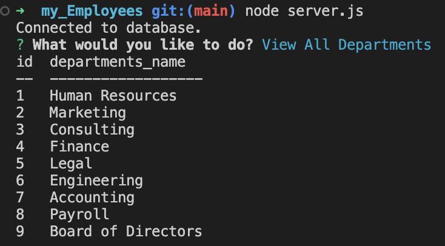
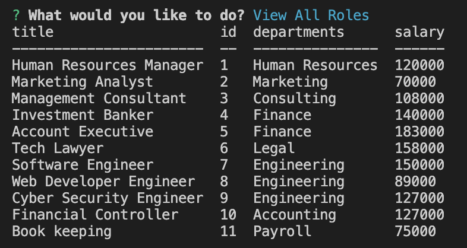

# Employee Tracker

## Description

A Content Management System (CMS) application that manages a company's employee database. This command-line application will be using Node.js, Inquirer, and MySQL to help keep a company organized. 

## Table of Contents
- [User Story](#user-story)
- [Usage](#usage)
- [Installation](#installation)
- [Technologies](#technologies)
- [Demo](#demo)
- [Application Screenshots](#application-screenshots)
- [Websites](#websites)
- [Author](#author)
- [License](#license)

### User Story

AS A business owner
I WANT to be able to view and manage the departments, roles, and employees in my company
SO THAT I can organize and plan my business

### Usage

- User will be able to view all departments
- User will be bale to view all roles
- User will be able to view all employees 
- User will be able to add a department
- User will be able to add a role
- User will be able to add an employee 
- User will be able to update an employee

### Installation

1. Visual Studio Code
2. Download or Cloan repository
3. Node.js
4. npm install to install the required npm packages 
5. inquirer: to interact with the user via the command line
6. mySQL2 to connect to your mySQL database and perform queries
7. console.table to print mySQL rows to the console

### Technologies

- Visual Studio Code
- Javascripts
- Node.js
- npm 
- inquirer 
- mySQL
- mySQL2 
- console.table.package

### Demo

[Employee Tracker Demo Video](https://drive.google.com/file/d/1B821X4w4eRJgM2RV11XFziHQv014u5JI/view?usp=sharing)

### Application Screenshots

### Websites 

- [Deployed Application](https://kimberlie901.github.io/Employee-Tracker/)
- [Github](https://github.com/kimberlie901/Employee-Tracker)

### Author

This application was created by Kimberlie Guillaume

- [Github](https://github.com/kimberlie901)
- [Portfolio](https://kimberlie901.github.io/Professional_Portfolio/) 
- [LinkedIn](https://www.linkedin.com/in/kjguill1024/)

### License 

Please refer to the LICENSE in the repo. Copyright (c) Kimberlie Guillaume. All rights reserved. 